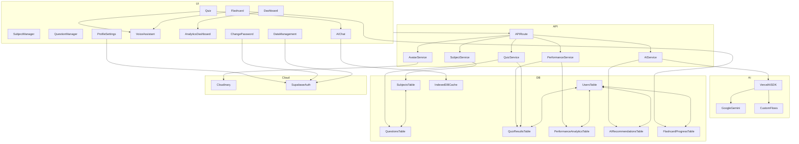

<div align="center">
  
  <h1>Mindhouse - AI-Powered Learning Platform</h1>
  <p>
    <strong>A next-generation AI-powered study companion that personalizes your learning experience... But that's just the beginning. The real question: What is education? What is consciousness? What is learning?</strong>
  </p>
  <p>
    <a href="https://mindhouse.vercel.app/"><strong>Visit Live Demo »</strong></a>
  </p>
  
  <!-- Project Status Badges -->
  <p>
    
    
    
    
    
    
    
    
    
    
  </p>
  <br>
</div>

<!-- Landing Page Demo GIF -->
<div align="center">
  
  <p><em>🎬 Live demo showcase - Mindhouse landing page interactions</em></p>
</div>

## ✨ Why Mindhouse?

Mindhouse goes beyond traditional study tools by focusing on each student's unique needs. It doesn't just display question banks; **it detects your learning gaps, offers personalized study strategies, and supports your entire study workflow with an intelligent assistant.** Our mission is to make learning more efficient, accessible, and personal.

This project was built to transform the learning experience using modern web technologies and generative AI.

## 🚀 Core Features

### **🤖 Advanced AI-Powered Study System:**
- **AI-Powered Question Generation:** Automatically generates high-quality questions using Google Gemini AI, customized by subject, topic, difficulty, and optional custom instructions.
- **AI-Powered Subject & Topic Generation:** Automatically constructs subjects and topics, performs quality checks, and sets study objectives.
- **AI Topic Explainer:** Generates comprehensive step-by-step topic summaries in clean Markdown layout.
- **AI Image Generation:** Generates subject-relevant illustrations dynamically via Pollinations.ai.
- **AI Tutor Chat:** Interactive chat helper to clarify concepts, offer hints, and walk through solutions step-by-step.
- **Voice AI Assistant:** Hands-free interaction supporting Turkish speech-to-text and text-to-speech.
- **Persistent Local History:** Local chat sessions saved securely in IndexedDB for guests and authenticated users.

### **🎤 Voice Assistant Features:**
- **Turkish Speech Recognition:** Real-time speech-to-text using Web Speech API.
- **Voice Navigation Commands:** Voice controls like "read question", "show options", "read hint", and "explain solution".
- **Text-to-Speech:** Natural audio readouts of AI responses and study texts.
- **Real-time Transcript UI:** Live interactive text transcription as you speak.

### **📚 Advanced Study Tools:**
- **Smart Flashcards:** Digital study cards operating on a Spaced Repetition scientific interval algorithm to optimize retention.
- **Performance Analytics:** Visual charts and metrics to track study progress and topic success rates.
- **Rich Markdown Formatting:** Beautifully rendered educational contents with highlight code blocks and media.

### **🎨 Modern User Experience:**
- **PWA Support:** Progressive Web App capabilities for offline usage and home-screen installation.
- **Premium Aesthetics:** Curated dark/light modes, premium glassmorphism, responsive comparison lists, and smooth micro-animations.
- **Robust Error Handling:** Informative user-friendly notifications and fallbacks.

### **⚙️ Security & Management:**
- **Comprehensive Admin Panels:** Effortless CRUD management panels for subjects, topics, and question banks.
- **Data Management:** Export, import, cloud backup, restore, and profile deletion tools.
- **Secure Authentication:** Supabase Auth integrations with safe password update modules.
- **Cloudinary Storage:** Secure avatar uploads and file management.

## 📋 Quality Assurance

This project is built to **enterprise-level** quality assurance standards. For detailed information on our comprehensive QA processes:

### **🔍 Manual Test Checklist**
- **[📋 QUALITY_ASSURANCE.md](docs/QUALITY_ASSURANCE.md)** - Extensive QA checklist containing 120+ test categories and 2000+ lines.
- **Test Coverage:** UI/UX, Performance, Security, Accessibility, Cross-browser, Cross-device
- **Scenarios:** 600+ specific test points verifying AI features, data pipelines, PWAs, and authentication.

### **📊 Test Metrics**
- **Quality Score:** 9.2/10 (Enterprise grade)
- **Feature Coverage:** 95%+ feature validation

## 🛠️ Tech Stack

<div align="center">
  <a href="https://circleci.com/" target="_blank"></a>
  <a href="https://nextjs.org/" target="_blank"></a>
  <a href="https://react.dev/" target="_blank"></a>
  <a href="https://www.typescriptlang.org/" target="_blank"></a>
  <a href="https://tailwindcss.com/" target="_blank"></a>
  <a href="https://cloud.google.com/vertex-ai/docs/generative-ai/gemini/gemini-api" target="_blank"></a>
  <a href="https://sdk.vercel.ai/" target="_blank"></a>
  <a href="https://pollinations.ai/" target="_blank"></a>
  <a href="https://orm.drizzle.team/" target="_blank"></a>
  <a href="https://supabase.com/" target="_blank"></a>
  <a href="https://www.postgresql.org/" target="_blank"></a>
  <a href="https://www.radix-ui.com/" target="_blank"></a>
  <a href="https://www.framer.com/motion/" target="_blank"></a>
  <a href="https://web.dev/progressive-web-apps/" target="_blank"></a>
  <a href="https://cloudinary.com/" target="_blank"></a>
  <a href="https://formspree.io/" target="_blank"></a>
  <a href="https://nodejs.org/" target="_blank"></a>
  <a href="https://www.npmjs.com/" target="_blank"></a>
  <a href="https://eslint.org/" target="_blank"></a>
  <a href="https://prettier.io/" target="_blank"></a>
  <a href="https://vercel.com/" target="_blank"></a>
  <a href="https://huggingface.co/" target="_blank"></a>
</div>

## 🏗️ Technical Architecture

Mindhouse relies on a robust layered N-tier architecture enforcing clean Separation of Concerns:

```
┌─────────────────────────────────────────────────────────┐
│                    Presentation Layer                   │
│  (React Components + Next.js Pages + Tailwind CSS)     │
├─────────────────────────────────────────────────────────┤
│                    Business Logic Layer                 │
│     (Services + API Routes + Server Actions)           │
├─────────────────────────────────────────────────────────┤
│                      AI Layer                          │
│        (Vercel AI SDK + Google Gemini API)              │
├─────────────────────────────────────────────────────────┤
│                   Data Access Layer                     │
│      (Drizzle ORM + Repository Pattern)                │
├─────────────────────────────────────────────────────────┤
│                    Database Layer                       │
│     (PostgreSQL via Supabase + IndexedDB Cache)        │
└─────────────────────────────────────────────────────────┘
```

- **Frontend:** Next.js 15 + React 18 + TypeScript
- **Styling:** Tailwind CSS + Radix UI Primitives + Framer Motion  
- **Database:** PostgreSQL (Supabase) + localforage (IndexedDB Cache) + Drizzle ORM
- **Row Level Security (RLS):** Supabase client policies isolate personal data.

## 📚 Technical Documentation

Explore detailed design specifications and integration plans:
- 📖 **[AI Question Generation Guide](docs/AI_QUESTION_GENERATION.md)** - Workflow details for Gemini question generation pipelines.
- 🚀 **[AI Deployment Guide](docs/AI_DEPLOYMENT_GUIDE.md)** - Production settings and API integrations.
- 🔧 **[Environment Setup](docs/ENVIRONMENT_SETUP.md)** - Guide to local environment variables.
- 🗄️ **[Supabase Storage Setup](docs/STORAGE-SETUP-GUIDE.md)** - Cloud storage bucket rules and asset configurations.
- ⚡ **[Edge Functions Setup](docs/EDGE_FUNCTIONS_SETUP.md)** - Serverless function deployments.
- 🎯 **[Project Blueprint](docs/BLUEPRINT.md)** - Platform blueprint and UI style guidelines.
- 📊 **[Technical Analysis](docs/TECHNICAL-ANALYSIS.md)** - Code structure, repository patterns, and architecture audits.

## 🚀 Quick Start - AI Service

Set up local AI-powered generation modules in minutes:

1. **Get a Google AI API Key:**
   - Generate your API key at [Google AI Studio](https://aistudio.google.com/)

2. **Configure your Environment:**
   - Create a `.env.local` file in the project root:
   ```bash
   GEMINI_API_KEY=your_api_key_here
   ```

3. **Install and Run:**
   ```bash
   npm install
   npm run dev
   ```

4. **Verify Generation:**
   - Navigate to `/question-manager`, click **"Generate Questions with AI"**, select a subject, and click generate.

<details>
<summary><b>🗺️ High-Level System Architecture (Mermaid Diagram)</b></summary>
<br>


</details>

<details>
<summary><b>📦 Detailed Installation Guide</b></summary>
<br>

1. **Clone the Repository:**
   ```bash
   git clone https://github.com/neurodivergent-dev/Mindhouse.git
   cd Mindhouse
   ```

2. **Install Dependencies:**
   ```bash
   npm install
   ```

3. **Populate Environment Variables (`.env.local`):**
   ```ini
   # AI Settings
   GEMINI_API_KEY=your_gemini_api_key

   # Supabase Client Settings
   NEXT_PUBLIC_SUPABASE_URL=your_supabase_url
   NEXT_PUBLIC_SUPABASE_ANON_KEY=your_supabase_anon_key
   DATABASE_URL=your_direct_postgres_url

   # Cloudinary configuration
   CLOUDINARY_CLOUD_NAME=your_cloudinary_name
   CLOUDINARY_API_KEY=your_cloudinary_key
   CLOUDINARY_API_SECRET=your_cloudinary_secret

   # Settings
   NEXT_PUBLIC_DEMO_MODE=false
   ```

4. **Initialize DB Schemas:**
   ```bash
   npm run db:generate
   npm run db:init
   ```

5. **Start Dev Server:**
   ```bash
   npm run dev
   ```
</details>

<details>
<summary><b>🗄️ Database Management CLI Commands</b></summary>
<br>

- **Generate Migration Scripts:**
  ```bash
  npm run db:generate
  ```
- **Apply Migrations to Target DB:**
  ```bash
  npm run db:migrate
  ```
- **Launch Drizzle Studio GUI:**
  ```bash
  npm run db:studio
  ```
</details>

## 🤝 Contributing

Contributions are welcome! Please follow these guidelines:
1. **Fork** the repository.
2. Create a **Feature Branch** (`git checkout -b feature/AmazingFeature`).
3. **Commit** your modifications (`git commit -m 'Add some AmazingFeature'`).
4. **Push** your branch (`git push origin feature/AmazingFeature`).
5. Open a **Pull Request**.

---
<div align="center">
  <p><strong>Mindhouse</strong> - Where knowledge meets intelligence.</p>
</div>
