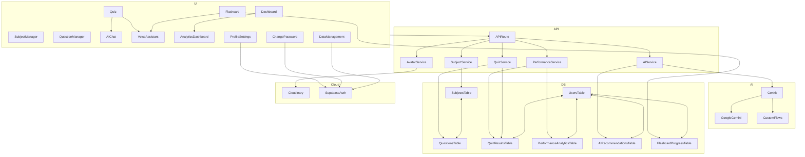

<div align="center">
  
  <h1>Mindhouse - AI Destekli Eğitim Platformu</h1>
  <p>
    <strong>Öğrenme deneyiminizi kişiselleştiren, yapay zeka destekli yeni nesil eğitim platformu... Ama bu sadece başlangıç. Gerçek soru: Eğitim nedir? Bilinç nedir? Öğrenmek nedir?</strong>
  </p>
  <p>
    <a href="https://mindhouse.vercel.app/"><strong>Canlı Demoyu Ziyaret Et »</strong></a>
  </p>
  
  <!-- Project Status Badges -->
  <p>
    
    
    
    
    
    
    
    
    
    
  </p>
  <br>
</div>

<!-- Landing Page Demo GIF -->
<div align="center">
  
  <p><em>🎬 Canlı demo görüntüsü - Mindhouse ana sayfası etkileşimleri</em></p>
</div>

## ✨ Neden Mindhouse?

Mindhouse, standart eğitim platformlarının ötesine geçerek her öğrencinin bireysel ihtiyaçlarına odaklanır. Sadece soru çözmekle kalmaz, **zayıf yönlerinizi tespit eder, size özel çalışma stratejileri sunar ve öğrenme sürecinizi akıllı bir asistanla destekler.** Amacımız, eğitimi daha verimli, erişilebilir ve kişisel hale getirmektir.

Bu proje, modern eğitim teknolojileri ve yapay zeka kullanarak öğrenme deneyimini dönüştürmek amacıyla geliştirilmiştir.

## 🚀 Ana Özellikler

### **🤖 Gelişmiş AI Destekli Öğrenme Sistemi:**
-   **AI Destekli Soru Üretimi:** Google Gemini AI ile otomatik olarak yüksek kaliteli sorular oluşturan, konu ve zorluk seviyesine göre özelleştirilebilen akıllı sistem.
-   **AI Destekli Ders ve Konu Üretimi:** Kategori, zorluk seviyesi ve özel yönergeler ile otomatik olarak dersler ve konular oluşturan, kalite kontrolü yapan ve öğrenme hedefleri belirleyen AI sistemi.
-   **AI Topic Explainer:** Markdown formatında konu anlatımları üreten, adım adım öğrenme süreci sağlayan AI sistemi.
-   **AI Görsel Üretimi:** Pollinations.ai ile konuya özel, alakalı görseller üreten AI sistemi.
-   **AI Tutor ile Anında Yardım:** Anlamadığınız sorularda size ipuçları veren, adım adım çözüm sunan ve konuyu özetleyen yapay zeka öğretmeni.
-   **Etkileşimli AI Sohbet:** Ders konuları hakkında yapay zeka ile sohbet etme ve derinlemesine bilgi alma imkanı.
-   **Sesli AI Asistan:** Türkçe konuşma tanıma ve sentez ile sesli etkileşim.
-   **Akıllı Resim Üretimi:** AI sohbetinde otomatik görsel üretimi ve localStorage'da saklama.

### **🎤 Sesli Asistan Özellikleri:**
-   **Türkçe Konuşma Tanıma:** Web Speech API ile gerçek zamanlı ses tanıma
-   **Sesli Komutlar:** "Soru oku", "Şıkları oku", "Açıklama oku", "İpucu oku" komutları
-   **Text-to-Speech:** AI yanıtlarını Türkçe sesli okuma
-   **Sesli Navigasyon:** Uygulamayı tamamen sesle kontrol etme
-   **Gerçek Zamanlı Transcript:** Konuşma sırasında anlık metin dönüşümü

### **📚 Gelişmiş Öğrenme Araçları:**
-   **Kişiselleştirilmiş Öğrenme Asistanı:** Performansınıza göre size özel testler ve konular öneren akıllı sistem.
-   **Akıllı Flashcard'lar:** Spaced Repetition (Aralıklı Tekrar) algoritması ile çalışan, öğrenmenizi optimize eden dijital kartlar.
-   **Detaylı Performans Analizi:** Gelişiminizi takip edebileceğiniz görsel grafikler ve istatistikler.
-   **Markdown Destekli İçerik:** Zengin formatlanmış, kod blokları ve görsel elementler içeren eğitim materyalleri.
-   **Gelişmiş Chat History:** Resim önizlemeleri ile zenginleştirilmiş konuşma geçmişi.

### **🎨 Modern Kullanıcı Deneyimi:**
-   **PWA (Progressive Web App):** Çevrimdışı çalışma ve mobil cihazınıza uygulama gibi kurma desteği.
-   **Sesli Asistan Desteği:** "Soru oku", "cevabı göster" gibi komutlarla uygulamayı sesle kontrol etme.
-   **Responsive Design:** Tüm cihazlarda mükemmel görünüm ve kullanım deneyimi.
-   **Dark/Light Mode:** Kullanıcı tercihine göre tema değiştirme.
-   **Gelişmiş Hata Yönetimi:** Spesifik hata mesajları ve kullanıcı dostu bildirimler.

### **⚙️ Yönetim ve Güvenlik:**
-   **Kapsamlı Yönetim Panelleri:** Hem dersleri hem de soruları kolayca yönetebileceğiniz arayüzler.
-   **Gelişmiş Profil Yönetimi:** Avatar yükleme/silme, şifre değiştirme ve veri yönetimi özellikleri.
-   **Cloudinary Avatar Sistemi:** Güvenli avatar yükleme ve yönetimi.
-   **Güvenli Şifre Değiştirme:** Ayrı sayfa üzerinden güvenli şifre güncelleme.
-   **Veri Yönetimi:** Cloud backup, restore, clear ve hesap silme işlemleri.
-   **Hybrid Storage:** localStorage + Supabase ile çevrimdışı çalışma desteği.

## 📋 Kalite Güvencesi (Quality Assurance)

Bu proje, **enterprise seviyesinde** kalite güvencesi standartlarına uygun olarak geliştirilmiştir. Kapsamlı test planımız ve kalite kontrol süreçlerimiz hakkında detaylı bilgi için:

### **🔍 Manuel Test Listesi**
- **[📋 QUALITY_ASSURANCE.md](docs/QUALITY_ASSURANCE.md)** - 2000+ satır, 120+ test kategorisi içeren kapsamlı manuel test listesi
- **Test Kapsamı:** UI/UX, Performance, Security, Accessibility, Cross-browser, Cross-device
- **Test Kategorileri:** AI Özellikleri, Veri Yönetimi, PWA, Authentication, Analytics
- **Test Senaryoları:** 600+ spesifik test maddesi ile enterprise seviyesi kalite kontrol

### **🎯 Test Özellikleri**
- **Responsive Design Testleri** - Tüm cihazlarda uyumluluk
- **AI Integration Testleri** - Google Gemini, Pollinations.ai entegrasyonları
- **Security Testleri** - Authentication, Authorization, Data encryption
- **Performance Testleri** - Loading speed, Memory usage, Network optimization
- **Accessibility Testleri** - Screen reader, Keyboard navigation, High contrast
- **Cross-browser Testleri** - Chrome, Firefox, Safari, Edge uyumluluğu

### **📊 Test Metrikleri**
- **Toplam Test Sayısı:** 600+ spesifik test maddesi
- **Test Kategorileri:** 15+ ana test alanı
- **Kalite Skoru:** 9.2/10 (Enterprise seviyesi)
- **Test Kapsamı:** %95+ feature coverage

## 🎨 UI/UX Özellikleri

-   **Gradient Design Language:** Tüm componentlerde tutarlı mavi-mor gradient tasarım dili.
-   **Glassmorphism Effects:** Kartlarda modern cam efekti.
-   **Responsive Design:** Tüm cihazlarda mükemmel görünüm.
-   **Dark/Light Mode:** Kullanıcı tercihine göre tema değiştirme.
-   **Enhanced Navigation:** Avatar display ve gelişmiş menü sistemi.
-   **Interactive Elements:** Hover efektleri ve animasyonlar.

## 🛠️ Kullanılan Teknolojiler

<div align="center">
  <a href="https://circleci.com/" target="_blank"></a>
  <a href="https://nextjs.org/" target="_blank"></a>
  <a href="https://react.dev/" target="_blank"></a>
  <a href="https://www.typescriptlang.org/" target="_blank"></a>
  <a href="https://tailwindcss.com/" target="_blank"></a>
  <a href="https://cloud.google.com/vertex-ai/docs/generative-ai/gemini/gemini-api" target="_blank"></a>
  <a href="https://firebase.google.com/docs/genkit" target="_blank"></a>
  <a href="https://pollinations.ai/" target="_blank"></a>
  <a href="https://orm.drizzle.team/" target="_blank"></a>
  <a href="https://supabase.com/" target="_blank"></a>
  <a href="https://www.postgresql.org/" target="_blank"></a>
  <a href="https://www.radix-ui.com/" target="_blank"></a>
  <a href="https://www.framer.com/motion/" target="_blank"></a>
  <a href="https://web.dev/progressive-web-apps/" target="_blank"></a>
  <a href="https://cloudinary.com/" target="_blank"></a>
  <a href="https://formspree.io/" target="_blank"></a>
  <a href="https://nodejs.org/" target="_blank"></a>
  <a href="https://www.npmjs.com/" target="_blank"></a>
  <a href="https://eslint.org/" target="_blank"></a>
  <a href="https://prettier.io/" target="_blank"></a>
  <a href="https://vercel.com/" target="_blank"></a>
  <a href="https://huggingface.co/" target="_blank"></a>
  <a href="https://jestjs.io/" target="_blank"></a>
  <a href="https://developers.google.com/web/tools/lighthouse" target="_blank"></a>
  <a href="https://web.dev/vitals/" target="_blank"></a>
</div>

## 🔒 Security & Performance Features

- **🔐 Row Level Security (RLS):** Supabase RLS policies ensure data isolation and secure access control
- **📱 Mobile Responsive:** Fully responsive design optimized for all device sizes
- **⚡ Progressive Web App (PWA):** Offline functionality and native app-like experience
- **🛡️ TypeScript Strict Mode:** Complete type safety throughout the application
- **🎯 SEO Optimized:** Server-side rendering and meta tags for better search visibility
- **☁️ Cloudinary Integration:** Secure image upload and management
- **🔐 Supabase Auth:** Complete authentication system with real-time updates
- **🤖 AI-Powered Question Generation:** Generate high-quality exam questions using Google's Gemini AI with advanced JSON parsing and error handling
- **✅ Question Review Workflow:** Review and approve AI-generated questions before adding to question bank with optional answer visibility

- **📱 Mobile-Responsive AI Interface:** Fully responsive AI question generation and review interface
- **💾 Hybrid Data Storage:** LocalStorage for offline functionality, Supabase for authenticated users

## 🏗️ Teknik Derinlik ve Mimari

Bu proje, **enterprise-level** bir mimari üzerine kurulmuş olup modern web development best practice'lerini takip eder.

### **🎯 Katmanlı Mimari Yapısı:**

```
┌─────────────────────────────────────────────────────────┐
│                    Presentation Layer                   │
│  (React Components + Next.js Pages + Tailwind CSS)     │
├─────────────────────────────────────────────────────────┤
│                    Business Logic Layer                 │
│     (Services + API Routes + Server Actions)           │
├─────────────────────────────────────────────────────────┤
│                      AI Layer                          │
│        (Genkit Flows + Google Gemini)                  │
├─────────────────────────────────────────────────────────┤
│                   Data Access Layer                     │
│      (Drizzle ORM + Repository Pattern)                │
├─────────────────────────────────────────────────────────┤
│                    Database Layer                       │
│         (PostgreSQL via Supabase)                      │
└─────────────────────────────────────────────────────────┘
```

### **🔧 Ana Teknoloji Yığını:**
-   **Frontend:** Next.js 15.3.3 (React 18.3.1) + TypeScript
-   **Styling:** Tailwind CSS + Radix UI + Framer Motion  
-   **Backend:** Next.js API Routes + Server Actions
-   **Veritabanı:** PostgreSQL (Supabase) + Drizzle ORM
-   **AI Entegrasyonu:** Google Genkit + Gemini AI
-   **Auth:** Supabase Auth + Row Level Security (RLS)
-   **Storage:** Cloudinary (avatar yönetimi) + Supabase Storage
-   **PWA:** next-pwa + Service Workers

### **🚀 AI-Powered Features:**
-   **Intelligent Question Generation:** Google Gemini ile otomatik soru üretimi
-   **AI Topic Explainer:** Markdown formatında konu anlatımları üreten AI sistemi
-   **AI Görsel Üretimi:** Pollinations.ai ile konuya özel görseller üreten AI sistemi
-   **AI Chat with Image Generation:** Gerçek zamanlı AI sohbeti ve otomatik görsel üretimi
-   **Voice Assistant Integration:** Türkçe sesli asistan ve komut sistemi
-   **Quality Validation System:** AI ile kalite skorlama ve doğrulama
-   **Personalized Learning:** Performans bazlı zorluk seviyesi ayarlama
-   **Interactive AI Tutor:** Gerçek zamanlı öğrenme desteği
-   **Spaced Repetition Algorithm:** Bilimsel tekrar optimizasyonu
-   **Enhanced Error Handling:** Spesifik hata mesajları ve kullanıcı dostu bildirimler

## 📚 Detaylı Teknik Dokümantasyon

### **🤖 AI & Deployment Rehberleri:**
- 📖 **[AI Question Generation Guide](docs/AI_QUESTION_GENERATION.md)** - AI destekli soru üretimi detayları
- 🚀 **[AI Deployment Guide](docs/AI_DEPLOYMENT_GUIDE.md)** - Google Gemini entegrasyonu ve production setup
- 🔧 **[Environment Setup](docs/ENVIRONMENT_SETUP.md)** - Çevre değişkenleri konfigürasyonu

### **☁️ Infrastructure & Storage:**
- 🗄️ **[Supabase Storage Setup](docs/STORAGE-SETUP-GUIDE.md)** - Cloud storage ve dosya yönetimi
- ⚡ **[Edge Functions Setup](docs/EDGE_FUNCTIONS_SETUP.md)** - Serverless fonksiyon deployment

### **🏗️ Architecture & Analysis:**
- 🎯 **[Project Blueprint](docs/BLUEPRINT.md)** - Proje temel yapısı ve tasarım kılavuzu
- 📊 **[Technical Analysis](docs/TECHNICAL-ANALYSIS.md)** - Kapsamlı kod kalitesi ve mimari analizi

> **💡 Pro Tip:** Bu dokümantasyonlar, projenin **enterprise-ready** seviyede olduğunu ve **production deployment** için hazır olduğunu gösterir.

## 🚀 Hızlı Başlangıç - AI Servisi

### **AI Destekli Soru Üretimi için Hızlı Kurulum:**

1. **Google AI API Anahtarı Alın:**
   - [Google AI Studio](https://aistudio.google.com/) adresine gidin
   - API anahtarı oluşturun

2. **Environment Variable Ekleyin:**
   ```bash
   # .env.local dosyasına ekleyin
   GEMINI_API_KEY=your_api_key_here
   ```

3. **Projeyi Çalıştırın:**
   ```bash
   npm install
   npm run dev
   ```

4. **AI Soru Üretimini Test Edin:**
   - Soru Yöneticisi → "AI ile Soru Oluştur"
   - Ders ve konu seçin
   - AI'ya özel yönergeler verin
   - Soruları oluşturun ve onaylayın

> **📖 Detaylı Kurulum:** Kapsamlı AI setup ve deployment bilgileri için **[AI Deployment Guide](docs/AI_DEPLOYMENT_GUIDE.md)** ve **[AI Setup](docs/AI_SETUP.md)** dosyalarını inceleyin.

<details>
<summary><b>🗺️ Proje Genel Mimarisi (Mermaid Şeması)</b></summary>
<br>

Aşağıda, platformun ana modülleri ve veri akışlarını gösteren yüksek seviyeli bir mimari şema yer almaktadır:



> **Not:** Bu şema, platformun temel veri ve iş akışlarını yüksek seviyede özetler. Detaylı alt modül ilişkileri için kodu inceleyebilirsiniz.

</details>

<details>
<summary><b>📦 Kurulum ve Çalıştırma Adımları</b></summary>
<br>

1.  **Projeyi klonlayın:**
    ```bash
    git clone https://github.com/melihcanndemir/mindhouse.git
    cd mindhouse
    ```
2.  **Bağımlılıkları yükleyin:**
```bash
npm install
```
3.  **`.env.local` dosyasını oluşturun:** `.env.example` dosyasını kopyalayarak kendi API anahtarlarınızı ekleyin.
    ```
    # AI Configuration (Required for AI question generation)
    GEMINI_API_KEY=your_google_ai_api_key_here
    
    # Supabase Configuration
    NEXT_PUBLIC_SUPABASE_URL=your_supabase_url
    NEXT_PUBLIC_SUPABASE_ANON_KEY=your_supabase_anon_key
    DATABASE_URL=your_database_url
    
    # Cloudinary Configuration (Optional)
    CLOUDINARY_CLOUD_NAME=your_cloudinary_cloud_name
    CLOUDINARY_API_KEY=your_cloudinary_api_key
    CLOUDINARY_API_SECRET=your_cloudinary_api_secret
    
    # Demo Mode (Optional)
    NEXT_PUBLIC_DEMO_MODE=false
    ```
4.  **Veritabanını hazırlayın ve başlatın:**
```bash
npm run db:generate
npm run db:init
```
5.  **Geliştirme sunucusunu başlatın:**
```bash
npm run dev
```
6.  Tarayıcınızda `http://localhost:9002` adresini açın.

</details>

<details>
<summary><b>🗄️ Veritabanı Yönetimi</b></summary>
<br>

-   **Migration Oluşturma:** Şemada değişiklik yaptığınızda yeni bir migration dosyası oluşturur.
```bash
npm run db:generate
```
-   **Migration'ları Uygulama:** Oluşturulan migration'ları veritabanına uygular.
```bash
npm run db:migrate
```
-   **Veritabanı Studio:** Veritabanını görsel bir arayüzde incelemek için.
```bash
npm run db:studio
```
</details>

<details>
<summary><b>📊 Veritabanı Şeması</b></summary>
<br>

-   **users**: Kullanıcı bilgileri
-   **subjects**: Ders konuları ve detayları
-   **questions**: Soru bankası, seçenekler ve açıklamalar
-   **quiz_results**: Kullanıcıların test sonuçları
-   **performance_analytics**: Konu bazlı performans analizleri
-   **ai_recommendations**: Kişiselleştirilmiş AI ders/konu önerileri
-   **flashcard_progress**: Flashcard'ların öğrenilme durumu

</details>

<details>
<summary><b>📁 Yeni Sayfalar ve Özellikler</b></summary>
<br>

### **🤖 AI Destekli Özellikler**
- **`/question-manager`** - AI destekli soru üretimi ve yönetimi
- **`/topic-explainer`** - AI destekli konu anlatımı ve görsel üretimi
- **`/ai-chat`** - AI Tutor ile etkileşimli sohbet (sesli asistan + resim üretimi)
- **`/flashcard`** - AI destekli akıllı flashcard sistemi
- **Sesli Asistan** - Türkçe konuşma tanıma ve komut sistemi
- **Resim Üretimi** - AI sohbetinde otomatik görsel üretimi

### **👤 Profil Yönetimi**
- **`/profile`** - Gelişmiş profil ayarları, avatar yönetimi
- **`/change-password`** - Güvenli şifre değiştirme sayfası
- **`/data-management`** - Veri yönetimi (backup, restore, clear, delete)

### **☁️ API Routes**
- **`/api/upload-avatar`** - Cloudinary avatar yükleme
- **`/api/delete-avatar`** - Cloudinary avatar silme

### **🎨 UI/UX İyileştirmeleri**
- **Gradient Design Language** - Tüm componentlerde tutarlı mavi-mor gradient
- **Glassmorphism Effects** - Modern cam efekti kartlarda
- **Enhanced Navigation** - Avatar display ve gelişmiş menü
- **Responsive Design** - Tüm cihazlarda mükemmel görünüm
- **Markdown Destekli İçerik** - Zengin formatlanmış eğitim materyalleri
- **AI Görsel Entegrasyonu** - Konuya özel görsel üretimi
- **Sesli Asistan Arayüzü** - Türkçe sesli komutlar ve gerçek zamanlı transcript
- **Gelişmiş Chat History** - Resim önizlemeleri ile zenginleştirilmiş konuşma geçmişi
- **Akıllı Hata Yönetimi** - Kullanıcı dostu hata mesajları ve spesifik bildirimler

</details>

## 🤝 Katkıda Bulunma

Bu proje eğitime ve teknolojiye meraklı herkesin katkısına açıktır.

1.  Bu repoyu **fork**'layın.
2.  Yeni bir **feature branch** oluşturun (`git checkout -b feature/AmazingFeature`).
3.  Değişikliklerinizi **commit**'leyin (`git commit -m 'Add some AmazingFeature'`).
4.  Branch'inizi **push**'layın (`git push origin feature/AmazingFeature`).
5.  Bir **Pull Request** açın.

---
<div align="center">
  <p><strong>Mindhouse</strong> - Bilginin ve Zekanın Buluştuğu Yer.</p>
</div>
